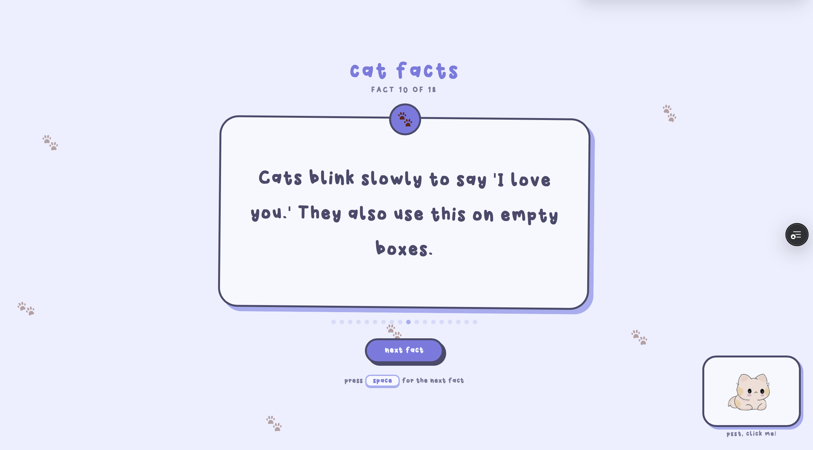

# random cat facts

## live demo: https://cat-facts-gamma.vercel.app

---

---

## what does it do?
random cat facts does exactly as the title states, it gives you random cat facts. 

to cycle through the facts, press `space` or click `next fact`. the background colors also change as you cycle through the facts.

--- 

## features: 
- random cat facts
- press `space` to cycle through the facts
- the color palette changes as you cycle through the facts
- floating paw prints in the bg
- a cute cat at the bottom, click it!

---

## how to run locally

```
git clone https://github.com/Hiba-Malkan/cat-facts.git
cd cat-facts

then run: 
python3 -m http.server 8080
```

and visit: 
```
localhost:8080
```

---

## tech stack
- html
- css 
- js

---

## known issues
- some browsers may handle custom fonts differently depending on caching.

---

## ai usage
- used ai for minor css fixes
- used ai to fix the rgbToHex and hextoRgb functions

---

#### written: sat, 19 july, 2026 by Hiba
##### built for onekey, a hackclub ysws


